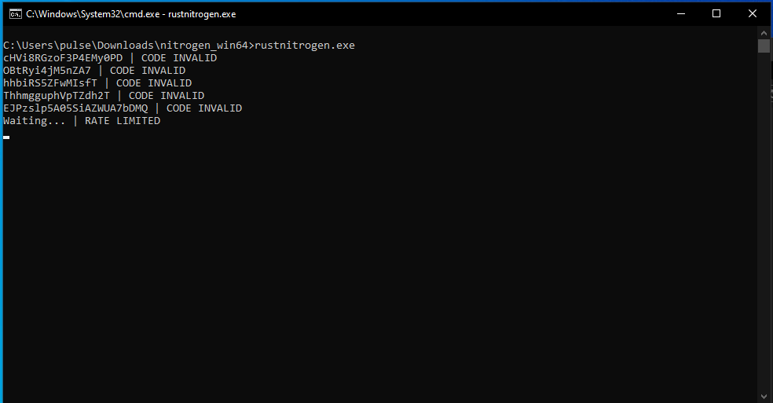

# Rust nitro generator
Discord nitro code generator written in rust.

### Instructions
- Extract "nitrogen_win64.zip"
- Run rustnitrogen.exe

To change the file name of codes.txt:
- [Install Rust](https://rustup.rs/)
- Download Source Code
- Find "codes.txt" in "src/main.rs"
- Change it to the new name of the file
- Run "cargo run" and it will work

